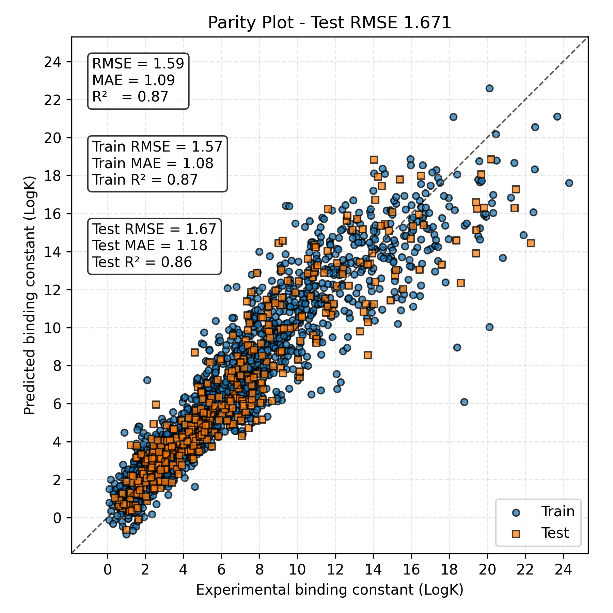

# MetalGCN

## Usage
Training model
```bash
cd model
python metal_pka_transfer.py -version metal_ver1
```
## Performance
| Model Version | RMSE | MAE | R² |
|---------------|------|-----|----|
| MetalGCN v14-test  | 1.67 | 0.118 | 0.86 |


