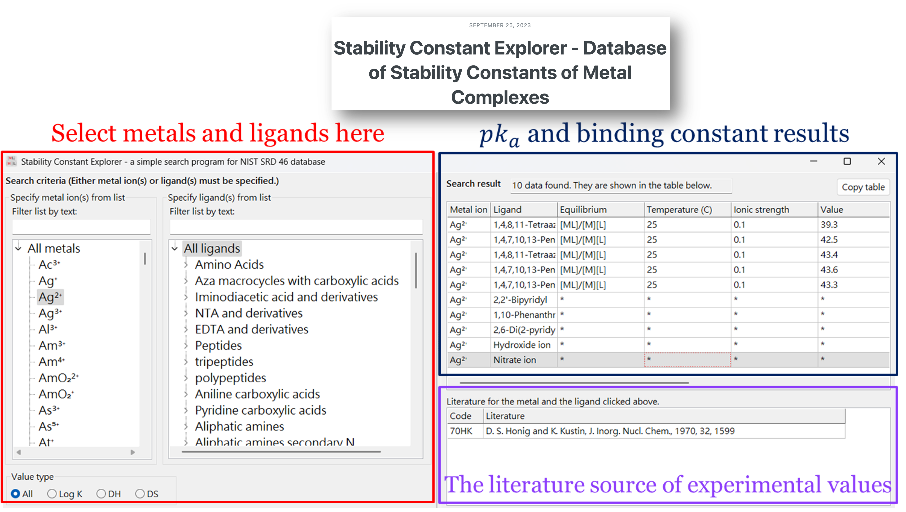

# GNN-MetalChelators
Developed pKa and binding constant prediction models using transfer learning to generate fractional composition diagrams and evaluate metal selectivity

## Database
### NIST 46 Database

The NIST 46 dataset comprises extensive data on proton-ligand binding and metal-chelate binding, along with essential properties required for modeling, such as pKₐ and binding constants.
## Data preprocess

- Progress of vectorization of molecule.
- Graph Neural Networks  enable the model to effectively learn chemical structural information.

Using SMARTS-based5 rules to label functional groups.

## Performance
### pKa model
#### parity plot

#### distribution plot

### Binding constant model

