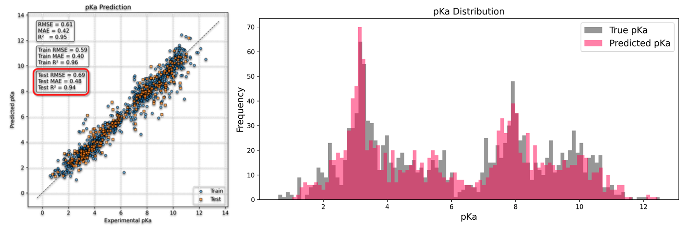

# GNN-MetalChelators
Developed pKa and binding constant prediction models using transfer learning to generate fractional composition diagrams and evaluate metal selectivity

## Database
### NIST 46 Database

The NIST 46 dataset comprises extensive data on proton-ligand binding and metal-chelate binding, along with essential properties required for modeling, such as pKₐ and binding constants.
## Data preprocess

- Progress of vectorization of molecule.
- Graph Neural Networks  enable the model to effectively learn chemical structural information.

Using SMARTS-based5 rules to label functional groups.

## Performance
### pKa model
#### parity plot
Test RMSE = 0.69, R^2 = 0.94

    

#### Distribution plot

    

---
### Binding constant model
#### parity plot
Test RMSE = 1.61, R^2 = 0.87

    

#### Distribution plot

    

#### Parity Plot with Metal-Ions Distinguished by Color

  
  

